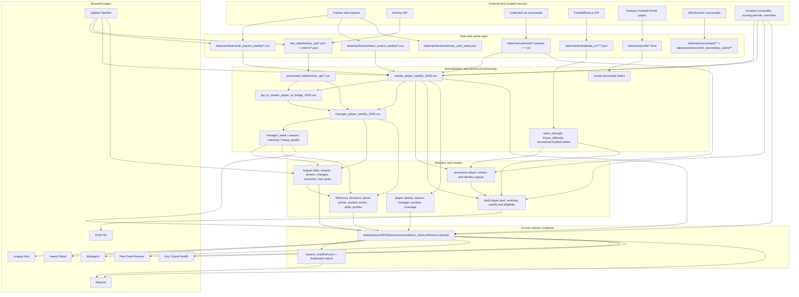

# Data Flow and Dataset Inventory

## Scope and Method

This document inventories the data files, API responses, caches, generated
tables, reports, and downloadable artifacts present in or referenced by the
project before the modular refactor.

The inventory was built from:

- every Python source file's read/write calls and path constants;
- every data-bearing folder in the repository;
- the active Streamlit renderer's page-level reads;
- analytics-builder inputs and outputs;
- ingestion, refresh, finalization, diagnostic, and experimental scripts.

Repeated exports are described as filename families. A family row covers every
concrete file matching that pattern (for example, all 494 roster CSVs), rather
than repeating identical provenance hundreds of times.

## Classification and DataManager Decision

| Value | Meaning |
| --- | --- |
| Raw | Source data captured without application-level aggregation |
| Processed | Normalized, joined, or canonical application data |
| Analytics | Derived metrics or presentation-ready views |
| Cache | Re-downloadable HTTP/browser/library response cache |
| Reference | Curated identity, season, or mapping data |
| Model | Draft/preseason model output |
| Quality/report | Validation, diagnostic, manifest, or human-review output |

The `DataManager` recommendation uses:

- **Yes**: stable runtime or analytics contract; provide a named loader/path.
- **Catalog only**: discover and preview it, but do not expose a bespoke
  domain method for every file.
- **Write service**: manage it through an ingestion/artifact writer, while
  runtime pages normally consume downstream data.
- **No**: transient cache, obsolete duplicate, source code, or isolated
  exploratory output.

## Important Storage Fact

The active 2025/26 dashboard does **not** read the current working copies under
`data/processed` and `data/analytics_views`. After season selection,
`core/legacy_renderer.py` resolves:

```text
data/seasons/2526/processed/
data/seasons/2526/analytics_views/
data/seasons/2526/reference/
data/seasons/2526/reports/
```

The pipeline builders still write working outputs to `data/processed`,
`data/analytics_views`, and `data/reference`. Finalization copies approved
working artifacts into `data/seasons/2526`. The DataManager therefore needs an
explicit distinction between a **working dataset namespace** and an immutable
**season snapshot namespace**.

## Complete Pipeline Graph



## Page-to-Dataset Matrix

Operations pages are intentionally broad: Raw Data Browser can load every CSV,
JSON, TXT, and Parquet under the selected season root; Key Output Health checks
the renderer's required file catalog; Reports reads the available report files.

| Page | Direct datasets |
| --- | --- |
| League Hub | `league_table.csv`, `league_hub_cards.csv`, `manager_profile_summary.csv`, `manager_streaks.csv`, `lineup_changes.csv`, `closest_games.csv`, `biggest_blowouts.csv`, `weekly_awards.csv`, `award_leaderboards.csv`, `matchup_week_summary_<season>.csv`, `fantrax_scoring_periods_<season>.csv` |
| Award Detail | `weekly_awards.csv`, `award_leaderboards.csv`, `manager_streaks.csv`, `closest_games.csv`, `biggest_blowouts.csv` |
| Managers | `manager_profile_summary.csv`, `league_table.csv`, `manager_week_summary_<season>.csv`, `matchup_week_summary_<season>.csv`, `lineup_decision_details_v2.csv`, `roster_adds_weekly.csv`, `position_points_manager_season.csv`, `ghost_points_manager_weekly.csv`, `manager_behavior_weekly.csv`, `manager_behavior_season.csv`, `formation_weekly.csv`, `formation_manager_summary.csv`, `manager_streaks.csv`, `manager_player_weekly_<season>.csv`, `manager_efficiency_weekly_v2.csv`, `lineup_quality_summary_<season>.csv` |
| Draft HQ | `data/models/draft_2627/draft_rankings_2627.csv`; optional `data/imports/draft/draft_eligibility_overrides_2627.csv`; paths for `draft_player_pool_2627.csv` and current player-pool data are displayed/contextual |
| Update Pipeline | `season_manifest.json`, `finalization_validation_report.txt`; indirectly creates/updates the full refresh and analytics pipeline |
| Raw Data Browser | Every CSV, JSON, TXT, and Parquet below the selected season root |
| Key Output Health | Six core processed tables, API merge report, and every file in the renderer's `ANALYTICS_FILES` catalog |
| Reports | Finalization, API merge, league awards, efficiency/ghost, formation, and recent refresh TXT reports |

The player analytics outputs under `analytics_views/player/` are generated and
tested but are not currently wired to a registered page.

## Raw Fantrax Web Exports

| Filename / pattern | Folder | Creation and producer | Page use | Analytics dependencies | Class | DataManager |
| --- | --- | --- | --- | --- | --- | --- |
| `Fantrax_WeeklyStats_AvailablePlayers_GWNN.csv` (41 present) | `data/raw/fantrax/all_players_weekly/` | Browser download automated by `fantrax/scraping/scrape_allplayers_weekly_fantrax.py`; orchestrated by refresh scripts | Browser only; indirect dashboard use | `build_master_weekly.py` concatenates it into available-player and master tables | Raw | Write service + catalog |
| `fantrax_weeklystats_<manager>_GWNN.csv` (494 active files present) | `data/raw/fantrax/team_rosters_weekly/` | Browser downloads by `scrape_team_rosters_weekly_fantrax.py`; one file per manager/week | Browser only; indirect Managers/awards use | `build_master_weekly.py` creates rostered/master data | Raw | Write service + catalog |
| `*_GWNN__archived_<timestamp>.csv` | `data/raw/fantrax/team_rosters_weekly/_archive/` | Existing export moved aside by roster scraper when replaced | None | Diagnostic/history only; excluded from normal glob | Raw archive | Catalog only |
| `fantrax_auth_state.json` | `data/raw/fantrax/` | Playwright storage state created/updated by both Fantrax scrapers | None | Required for authenticated web exports | Cache/credential state | No domain loader; ingestion-owned and access-restricted |
| `duplicate_rostered_player_debug.csv` | `data/processed/` (referenced; not present) | `diagnose_rostered_duplicates.py` | Browser/health only if present | Diagnostics only | Quality | Catalog only |
| `duplicate_rostered_player_file_debug.csv` | `data/processed/` | `diagnose_rostered_duplicates.py` from roster exports | Browser only | Diagnostics only | Quality | Catalog only |

## Raw Understat Data

| Filename | Folder | Creation and producer | Page use | Analytics dependencies | Class | DataManager |
| --- | --- | --- | --- | --- | --- | --- |
| `schedule.parquet` | `data/raw/understat/` | `scrape_understat_player_match_stats.py` via soccerdata | Browser if in selected namespace | Converted/exported and used to map matches to Fantrax GW | Raw | Write service + named loader |
| `player_match_stats.parquet` | Same | Same scraper; append/upsert behavior | Browser | Source for weekly Understat CSV and master | Raw | Write service + named loader |
| `players.parquet` | Same | `scrape_understat_epl_players.py` | Browser | Player identity/preseason context | Raw | Write service + named loader |
| `understat_schedule_2526_ENG-Premier_League.csv` | Same | `scrape_understat_to_csv.py` from soccerdata results | Browser | Match/GW mapping | Raw-normalized | Yes |
| `understat_player_match_stats_2526_ENG-Premier_League.csv` | Same | `scrape_understat_to_csv.py` | Browser; indirect all analytics | `build_master_weekly.py`; preseason context | Raw-normalized | Yes |
| `understat_players_season_2526_ENG-Premier_League.csv` | Same | `scrape_understat_to_csv.py` | Browser | Preseason player context | Raw-normalized | Yes |
| Same three CSVs | `data/seasons/2526/raw_index/` | Copied/indexed by season finalization | Raw Data Browser | Historical provenance only | Snapshot raw index | Catalog only |

## Raw Fantrax API and API-Normalized Tables

The raw API scripts target legacy roots `raw_data/fantrax_api/` and
`processed_data/fantrax_api/`. In the current checkout, only
`processed_data/fantrax_api/api_player_lookup.csv` is present; the other files
remain required/referenced pipeline contracts.

| Filename / pattern | Folder | Creation and producer | Page use | Analytics dependencies | Class | DataManager |
| --- | --- | --- | --- | --- | --- | --- |
| `league_info.json` | `raw_data/fantrax_api/` | Fantrax `getLeagueInfo` response saved by `fetch_fantrax_api_data.py` | None direct | `transform_fantrax_api_json.py` creates player/settings/league/scoring tables | Raw API | Write service + named loader |
| `standings.json` | Same | Fantrax `getStandings` response, same producer | None direct | Creates standings and matchups | Raw API | Write service + named loader |
| `periods_to_fetch.json` | Same | Fetch plan emitted by `fetch_fantrax_api_data.py` | None | Fetch reproducibility | Quality/manifest | Catalog only |
| `rosters/rosters_period_NN.json` | `raw_data/fantrax_api/rosters/` | Per-period `getTeamRosters` response, same producer | None | Flattened into `rosters_by_week.csv` | Raw API | Write service + family loader |
| `fetch_manifest.json` | `raw_data/fantrax_api/` | Fetch summary from same producer | Reports only if manually browsed | Operational validation | Manifest | Catalog only |
| `player_lookup/getPlayerIds_EPL.json` | `raw_data/fantrax_api/player_lookup/` | Fantrax player-ID endpoint via `fetch_fantrax_api_player_ids_epl.py` | None | Flattened to player lookup; player bridge | Raw API | Write service + named loader |
| `standings.csv` | `processed_data/fantrax_api/` | `transform_fantrax_api_json.py` | Indirect League Hub/Managers through builders | League table and roster merge | Processed | Yes |
| `matchups_by_week.csv` | Same | Same transformer | Indirect Hub/Managers | Roster merge and matchup summaries | Processed | Yes |
| `player_info.csv` | Same | Same transformer | Health/report indirectly | API validation; legacy merge | Processed | Yes |
| `rosters_by_week.csv` | Same | Same transformer from roster JSON family | Indirect Managers | ID bridge, roster merge, validation | Processed | Yes |
| `roster_settings.csv` | Same | Same transformer | None direct | API validation; rules inspection | Processed/reference | Yes |
| `league_summary.csv` | Same | Same transformer | None direct | Metadata/inspection | Processed | Yes |
| `scoring_rules.csv` | Same | Same transformer | None direct | Rules inspection | Processed/reference | Yes |
| `scoring_rules_compact.csv` | Same | Same transformer | None direct | Rules inspection | Processed/reference | Yes |
| `api_player_lookup.csv` | Same (present) | `fetch_fantrax_api_player_ids_epl.py` or `flatten_fantrax_api_player_lookup.py` | Indirect Draft/Managers | Name-based bridge and roster merge | Processed/reference | Yes |
| `api_player_lookup_report.txt` | Same | Same lookup scripts | Reports only if manually browsed | Validation | Report | Catalog only |
| `validation_roster_counts.csv` | Same | `validate_fantrax_api_layer.py` | Health/browser if exposed | API quality checks | Quality | Catalog only |
| `validation_missing_roster_player_ids.csv` | Same | Same validator | Same | API quality checks | Quality | Catalog only |
| `validation_missing_matchup_team_ids.csv` | Same | Same validator | Same | API quality checks | Quality | Catalog only |
| `validation_duplicate_player_periods.csv` | Same | Same validator | Same | API quality checks | Quality | Catalog only |
| `validation_report.txt` | Same | Same validator | Reports if routed | Refresh gating/diagnosis | Report | Catalog only |

## Identity and Reference Data

| Filename | Folder | Creation and producer | Page use | Analytics dependencies | Class | DataManager |
| --- | --- | --- | --- | --- | --- | --- |
| `seasons.json` | `config/` | Human-maintained catalog loaded by `config.project_paths.load_seasons()` | Every page: season labels, visibility, readiness, and snapshot root | Finalization/operations context | Configuration/reference | Yes, or a separate ConfigManager |
| `understat_fantrax_player_id_map.csv` | `data/reference/` | Curated/existing crosswalk; no canonical producer in current source | Indirect all historical pages | Master weekly build and name bridge | Reference | Yes; governed editable dataset |
| `fantrax_scoring_periods_2526.csv` | Same | Curated Fantrax-to-date/GW mapping; no producer found | League Hub direct | Understat match-to-GW and master build | Reference | Yes |
| `api_to_master_player_id_bridge_2526.csv` | Same | `build_name_based_api_player_bridge.py` or older evidence bridge builder | Indirect Managers | API/master roster merge | Reference | Yes |
| `api_to_master_player_id_bridge_candidates_2526.csv` | Same | Name-based bridge builder | Browser/review | Human review for bridge | Quality/reference | Yes, review workflow |
| `api_to_master_player_id_bridge_unresolved_2526.csv` | Same | Name-based bridge builder | Browser/review | Bridge coverage | Quality/reference | Yes, review workflow |
| `api_to_master_player_id_candidates_2526.csv` | Same | Older `build_api_to_master_player_id_bridge.py` | Browser/review | Legacy bridge method | Quality/reference | Catalog only; superseded |
| `api_to_master_player_id_unresolved_2526.csv` | Same | Older bridge builder | Browser/review | Legacy bridge method | Quality/reference | Catalog only; superseded |
| `api_to_master_player_id_bridge_report_2526.txt` | Same | Either bridge workflow | Reports/browser | Bridge validation | Report | Catalog only |
| `master_player_crosswalk.csv` | Same | Crosswalk build workflow not present in current Python sources | Draft context | Preseason identity resolution | Reference | Yes |
| `master_player_crosswalk_identity_only.csv` | Same | Same external/removed workflow | Draft context | Identity-only matching | Reference | Yes |
| `master_crosswalk_review_queue.csv` | Same | Same external/removed workflow | Manual review | Crosswalk governance | Quality/reference | Yes, review workflow |
| `players_with_team_changes.csv` | Same | Same external/removed workflow | Draft context | Preseason team resolution | Reference | Yes |
| `historical_inactive_players.csv` | Same | Same external/removed workflow | Draft context | Current-player filtering | Reference | Yes |
| `current_fantrax_player_pool_2627.csv` | Same | Current pool export/build process; used as a discoverable draft input | Draft HQ indirectly | Draft builder | Reference/input | Yes |
| `data/crosswalk/player_crosswalk.csv` | `data/crosswalk/` | Curated crosswalk; no active reader found | None | No active dependency found | Reference/orphan | Catalog only pending consolidation |
| `data/processed/crosswalks/understat_to_fantrax/*.csv` (4) | `data/processed/crosswalks/understat_to_fantrax/` | Earlier crosswalk process; no current producer/reader found | None | Historical crosswalk diagnostics | Quality/legacy | Catalog only |

Frozen copies under `data/seasons/2526/reference/` are the page-facing
historical versions and should be resolved by the DataManager's snapshot
namespace rather than treated as separate logical dataset types.

## Core Processed Datasets

| Filename | Folder | Creation and producer | Page use | Analytics dependencies | Class | DataManager |
| --- | --- | --- | --- | --- | --- | --- |
| `fantrax_available_weekly_all_2526.csv` | `data/processed/` | Concatenated weekly available exports by `fantrax.analytics.core.build_master_weekly` | Health/browser; indirect pages | Master dataset | Processed | Yes |
| `fantrax_rostered_weekly_all_2526.csv` | Same | Parsed/concatenated manager roster exports by same builder | Health/browser | Master dataset | Processed | Yes |
| `understat_weekly_by_fantrax_gw_2526.csv` | Same | Understat match rows mapped and aggregated by same builder | Browser | Master dataset | Processed | Yes |
| `understat_match_to_fantrax_gw_2526.csv` | Same | Match-to-scoring-period mapping by same builder | Browser | Audit support for master | Processed | Yes |
| `master_player_weekly_2526.csv` | Same | Join of available, rostered, Understat, crosswalk, and scoring periods by same builder | Health; indirect all league analytics | Bridge, manager merge, player views, preseason, draft | Processed canonical | Yes; core contract |
| `unmapped_fantrax_players_2526.csv` | Same | Master builder | Browser/refresh console | Crosswalk QA | Quality | Yes, quality method |
| `unmapped_understat_players_2526.csv` | Same | Master builder | Browser/refresh console | Crosswalk QA | Quality | Yes, quality method |
| `crosswalk_duplicates_fantrax_2526.csv` | Same (referenced, not present) | Master builder only when duplicates exist | Browser | Crosswalk QA | Quality | Catalog only |
| `manager_player_weekly_2526.csv` | Same | `merge_master_with_api_rosters_v2.py` from master, API tables, lookup, and bridge | Managers direct; health | Every manager/team analytics builder | Processed canonical | Yes; core contract |
| `manager_week_summary_2526.csv` | Same | Same roster merge | League Hub and Managers direct | Team and manager analytics | Processed canonical | Yes |
| `manager_season_summary_2526.csv` | Same | Same roster merge | Health/indirect pages | Team and manager analytics | Processed canonical | Yes |
| `matchup_week_summary_2526.csv` | Same | Same roster merge using API matchups | League Hub and Managers direct | League awards/views | Processed canonical | Yes |
| `lineup_quality_summary_2526.csv` | Same | Same roster merge | Managers and Health direct | Manager context | Processed | Yes |
| `api_merge_validation_report_2526.txt` | Same | Same roster merge | Reports and Health | Merge validation | Report | Catalog only |

`data/processed/merge_master_with_api_rosters.py` is Python source misplaced in
a data directory, not a dataset. It is superseded by
`fantrax/api/merge_master_with_api_rosters_v2.py` and should not enter the
DataManager.

## Team and League Analytics Views

All are produced by
`fantrax.analytics.team.build_league_awards_views` from manager week, manager
season, matchup week, and manager-player data. The active-season builder writes
`data/analytics_views/`; the dashboard reads the frozen equivalents under the
selected season.

| Filename | Page use | Downstream analytics | Class | DataManager |
| --- | --- | --- | --- | --- |
| `league_table.csv` | League Hub, Managers | Hub cards; season setup/results | Analytics | Yes |
| `weekly_awards.csv` | League Hub, Award Detail | Award presentation | Analytics | Yes |
| `award_leaderboards.csv` | League Hub, Award Detail | Award presentation | Analytics | Yes |
| `manager_streaks.csv` | League Hub, Award Detail, Managers | Manager profile/context | Analytics | Yes |
| `lineup_changes.csv` | League Hub | Efficiency builder optionally uses it | Analytics | Yes |
| `closest_games.csv` | League Hub, Award Detail | Award presentation | Analytics | Yes |
| `biggest_blowouts.csv` | League Hub, Award Detail | Award presentation | Analytics | Yes |
| `league_hub_cards.csv` | League Hub | None | Analytics/presentation | Yes |
| `league_awards_report.txt` | Reports | Validation only | Report | Catalog only |

## Manager Analytics Views

### Efficiency, ghost, roster, position, and profile builder

`fantrax.analytics.manager.build_efficiency_ghost_awards_views` consumes
manager-player, manager-week, manager-season, and optionally lineup changes.

| Filename | Page use | Downstream analytics | Class | DataManager |
| --- | --- | --- | --- | --- |
| `manager_efficiency_weekly.csv` | Not directly (v2 is preferred) | Season efficiency/profile | Analytics/legacy | Catalog only |
| `manager_efficiency_season.csv` | Health and manager context | Profile/awards | Analytics | Yes |
| `lineup_decision_details.csv` | Not directly (v2 preferred) | Decision audit | Analytics/legacy | Catalog only |
| `ghost_points_player_weekly.csv` | Health/browser | Ghost leader aggregation | Analytics | Yes |
| `ghost_points_player_leaders.csv` | Health; possible award cards | Award/profile context | Analytics | Yes |
| `ghost_points_manager_weekly.csv` | Managers | Season ghost aggregation | Analytics | Yes |
| `ghost_points_manager_season.csv` | Health | Awards/profile | Analytics | Yes |
| `position_points_manager_weekly.csv` | Health/browser | Season position totals | Analytics | Yes |
| `position_points_manager_season.csv` | Managers | Manager comparison | Analytics | Yes |
| `roster_adds_weekly.csv` | Managers | Add leaders/profile | Analytics | Yes |
| `roster_adds_leaders.csv` | Health/browser | Awards/profile | Analytics | Yes |
| `manager_awards_dynamic.csv` | Health/browser | Manager awards | Analytics | Yes |
| `manager_profile_summary.csv` | League Hub, Managers | None | Analytics/presentation | Yes |
| `efficiency_ghost_awards_report.txt` | Reports | Validation | Report | Catalog only |

### Decision builder v2

`fantrax.analytics.manager.build_decision_views` consumes
`manager_player_weekly_2526.csv`.

| Filename | Page use | Downstream analytics | Class | DataManager |
| --- | --- | --- | --- | --- |
| `manager_efficiency_weekly_v2.csv` | Managers; Health | Manager decision display | Analytics | Yes; preferred efficiency-week contract |
| `lineup_decision_details_v2.csv` | Managers; Health | Manager decision display | Analytics | Yes; preferred decision-detail contract |
| `manager_decision_validation_report.txt` | Reports/browser | Validation | Report | Catalog only |

### Referenced but no producer in the current repository

The renderer expects the following under each season's analytics directory:

| Filename | Page use | Status | Class | DataManager |
| --- | --- | --- | --- | --- |
| `manager_behavior_weekly.csv` | Managers | No file and no producer found | Analytics contract gap | Reserve dataset key only after producer is restored |
| `manager_behavior_season.csv` | Managers | No file and no producer found | Analytics contract gap | Same |
| `formation_weekly.csv` | Managers | No file and no producer found | Analytics contract gap | Same |
| `formation_manager_summary.csv` | Managers | No file and no producer found | Analytics contract gap | Same |
| `formation_league_summary.csv` | Health catalog | No file and no producer found | Analytics contract gap | Same |
| `formation_report.txt` | Reports | No file and no producer found | Report contract gap | Catalog only |

`setup_historical_season_2526.py` also references missing
`build_manager_behavior_views.py` and `build_formation_views.py`, confirming
that these were expected modules but are not in this checkout.

## Player Analytics Views

All files live in `data/analytics_views/player/` and are produced by
`fantrax.analytics.player.build_player_views` from
`master_player_weekly_2526.csv`.

| Filename | Page use | Analytics role | Class | DataManager |
| --- | --- | --- | --- | --- |
| `player_weekly.csv` | No registered page | Clean player-week view | Analytics | Yes |
| `player_season_summary.csv` | No registered page | Season player aggregates | Analytics | Yes |
| `player_manager_summary.csv` | No registered page | Ownership/manager aggregates | Analytics | Yes |
| `player_position_weekly.csv` | No registered page | Eligible-position rescoring | Analytics | Yes |
| `player_data_coverage.csv` | No registered page | Coverage/quality metrics | Quality analytics | Yes |
| `player_views_report.txt` | Reports only if manually browsed | Validation | Report | Catalog only |

Frozen season copies are not currently present in the listed
`data/seasons/2526/analytics_views/` snapshot, so these views are generated but
not part of the historical UI contract.

## FootballData.io Raw Responses and Derived Analytics

### API/bootstrap responses

| Filename / pattern | Folder | Creation and producer | Consumers | Class | DataManager |
| --- | --- | --- | --- | --- | --- |
| `leagues.json` | `data/raw/footballdata_io/` | FootballData API discovery/test scripts | Coverage/full-refresh planning | Raw API/cache | Catalog only |
| `league_15_seasons.json` | Same | Coverage API script | Season ID discovery | Raw API/cache | Catalog only |
| `search_english_premier_league.json` | Same | API search test | Manual evaluation | Raw API/cache | No |
| `coverage_test/teams_2627.json` | `data/raw/footballdata_io/coverage_test/` | `test_footballdata_coverage.py` | `refresh_footballdata_full.py`; preseason/draft discovery | Raw API | Yes |
| `coverage_test/matches_2526_page_1.json`, `matches_2627_page_1.json` | Same | Coverage test | Normalizers, fixture model, refresh planning | Raw API/cache | Yes |
| `coverage_test/team_<id>_players.json` | Same | Coverage test | Player normalization/preseason | Raw API/cache | Catalog/family loader |
| `coverage_test/team_<id>_stats_2526.json` | Same | Coverage test | Team strength | Raw API/cache | Catalog/family loader |
| `coverage_test/player_<id>_stats_2526.json` | Same | Coverage test | Capability evaluation | Raw API/cache | No |
| `coverage_test/match_<id>_stats.json`, `match_<id>_events.json` | Same | Coverage test | Capability evaluation | Raw API/cache | No |
| `full_refresh/players/team_<id>_players.json` | `data/raw/footballdata_io/full_refresh/` | `refresh_footballdata_full.py` | Player normalization/preseason/draft | Raw API | Write service + family loader |
| `full_refresh/team_stats/team_<id>_stats_2526.json` | Same | Same | `build_team_strength.py` | Raw API | Write service + family loader |
| `full_refresh/matches/matches_<season>_page_<n>.json` | Same | Same | Fixture normalization/model | Raw API | Write service + family loader |
| `full_refresh/refresh_manifest.json` | Same | Same | Operational audit | Manifest | Catalog only |

### Derived football/draft foundation

| Filename | Folder | Creation and producer | Page use | Downstream analytics | Class | DataManager |
| --- | --- | --- | --- | --- | --- | --- |
| `team_strength_2526.csv` | `data/analytics/draft/` | `analytics/build_team_strength.py` from team-stat JSON | Draft indirect | Preseason and draft builders; fixture strength | Analytics | Yes |
| `fixture_difficulty_2627.csv` | Same | `analytics/build_fixture_strength.py` from match JSON + team strength | Draft indirect | Preseason and draft builders | Analytics | Yes |
| `teams_2627.csv` | Same | `scripts/build_draft_foundation.py` / normalization workflow | Draft indirect | Current-team identity | Processed | Yes |
| `fixtures_2627_normalized.csv` | Same | Same foundation workflow | Draft indirect | Draft fixture context | Processed | Yes |
| `matches_2526_normalized.csv` | Same | Same foundation workflow | Draft indirect | Historical team context | Processed | Yes |
| `football_players_2526.csv` | Same | Same foundation workflow | Draft indirect | Preseason player context | Processed | Yes |

The folder also contains duplicate/earlier draft foundation outputs (six CSVs
total in the checkout). Dataset keys should describe their semantics, not bind
callers to a script version.

## Preseason and Draft Model Data

### Preseason context

Produced by `scripts/build_preseason_player_context_2627.py` from the historical
master, Understat players, normalized football players, team strength, fixture
strength, and identity/reference inputs.

| Filename | Folder | Page use | Downstream analytics | Class | DataManager |
| --- | --- | --- | --- | --- | --- |
| `player_context_preseason_2627.csv` | `data/models/preseason_2627/` | Draft indirect | Draft model input | Model/intermediate | Yes |
| `current_player_pool_2627.csv` | Same | Draft indirect | Draft model input | Model/intermediate | Yes |
| `player_identity_crosswalk_2627.csv` | Same | Draft indirect | Identity audit/model input | Reference/model | Yes |
| `player_identity_review_2627.csv` | `data/quality/preseason_2627/` | Manual review | Improves identity matching | Quality | Yes, review workflow |

### Draft outputs

The canonical launcher `analytics/draft/builder.py` executes
`scripts/build_draft_tool_v1_2_2_2627.py`. Inputs include current Fantrax/API
player data, historical master, API bridge, ghost leaders, football team and
fixture context, and optional eligibility overrides.

| Filename | Folder | Creation | Page use | Class | DataManager |
| --- | --- | --- | --- | --- | --- |
| `draft_player_pool_2627.csv` | `data/models/draft_2627/` | Versioned draft builder | Draft contextual/export support | Model | Yes |
| `draft_rankings_2627.csv` | Same | Same; ranked model output | Draft HQ direct | Model/analytics | Yes; core draft contract |
| `draft_data_quality_2627.csv` | `data/quality/draft_2627/` | Same | Health/manual review | Quality | Yes |
| `draft_eligibility_report_2627.csv` | Same | Same | Draft validation | Quality | Yes |
| `draft_eligibility_overrides_2627.csv` | `data/imports/draft/` (referenced; absent in current listing) | Human-maintained override input | Draft HQ optional load; draft builder | Reference/input | Yes; governed editable dataset |
| `Fantrax-Players-Cheeky FC (7).csv` | `data/imports/draft/` | Manual Fantrax export | Draft builder discovery/input | Raw import | Write/import service |

Older versioned draft scripts produce the same logical output filenames. They
are alternate producers, not separate datasets.

## Pundit Data

| Filename / pattern | Folder | Creation and producer | Page use | Analytics dependencies | Class | DataManager |
| --- | --- | --- | --- | --- | --- | --- |
| `home.html`, `predicted_lineups.html`, `fixture_analysis.html`, `points_predictor.html`, `*_iframe_1.html` (6 files) | `data/raw/pundit/` | HTTP cache/scrape by `football_data.sources.pundit.scraper` | None direct | Parsed by Pundit parser | Raw/cache | Catalog only; ingestion-owned |
| `pundit_predicted_lineups.csv` | `data/processed/` | `football_data.sources.pundit.run` | Browser only | Future draft/availability context; no active downstream reader found | Processed | Yes if adopted |
| `pundit_team_lineup_summary.csv` | Same | Same | Browser only | No active downstream reader found | Processed | Yes if adopted |
| `pundit_fixture_difficulty_raw.csv` | Same | Same | Browser only | No active downstream reader found | Processed | Yes if adopted |
| `pundit_page_inventory.json` | `data/reports/` | Same | Reports only if manually exposed | Scrape audit | Report | Catalog only |
| `pundit_scrape_summary.json` | Same | Same | Same | Scrape audit | Report | Catalog only |

## Soccerdata and WhoScored Caches

These are exploratory/source-library caches, not current dashboard contracts.
They are nevertheless part of the repository artifact inventory.

| Filename / pattern | Folder | Creation and producer | Consumers | Class | DataManager |
| --- | --- | --- | --- | --- | --- |
| `coverage_2627.zip` | `data/raw/soccerdata/` | Saved coverage artifact from `test_soccerdata_2627.py` workflow | Manual/offline review | Cache/archive | No |
| Provider output CSVs such as `fbref__read_schedule.csv`, `understat__read_*`, `espn__read_*`, `sofascore__read_*` (8 present) | `data/raw/soccerdata/coverage_2627/<provider>/` | `test_soccerdata_2627.py` | Coverage comparison only | Raw/exploratory | Catalog only |
| Provider `_soccerdata_cache` HTML/JSON responses (480+ present across ESPN, FBref, Sofascore, Understat, etc.) | `data/raw/soccerdata/coverage_2627/**/_soccerdata_cache/` | soccerdata library while running coverage test | Reusable only by soccerdata/test workflow | Cache | No bespoke DataManager methods; exclude from normal runtime catalog |
| `soccerdata_2627_coverage_report.json` | `data/raw/soccerdata/coverage_2627/` | `test_soccerdata_2627.py` | Manual evaluation | Report | Catalog only |
| `whoscored_schedule_2627.csv` | `data/raw/whoscored/` | `football_data.sources.whoscored.probe` | Manual evaluation/future fixture source | Raw-normalized | Catalog only until adopted |
| WhoScored `_soccerdata_cache` season/match HTML and JSON (14 present) | `data/raw/whoscored/_soccerdata_cache/` | WhoScored/soccerdata probe | Probe reruns | Cache | No |
| `whoscored_2627_probe.json` | `data/reports/` | WhoScored probe | Manual report | Report | Catalog only |

## API-Football Evaluation Artifacts

`scripts/evaluate_api_football.py` can create a larger response set; only three
JSON files are currently present.

| Filename / pattern | Folder | Creation | Consumers | Class | DataManager |
| --- | --- | --- | --- | --- | --- |
| `01_status.json` | `api_football_evaluation/raw/` | API-Football status response | Evaluation script/report only | Raw API/evaluation | No |
| `02_league_current.json` | Same | League response | Evaluation only | Raw API/evaluation | No |
| `02b_league_all_seasons.json` | Same when requested | League history response | Evaluation only | Raw API/evaluation | No |
| `03_teams.json` | Same when produced | Teams response | Evaluation only | Raw API/evaluation | No |
| `04_squad_<team>.json` | Same when produced | Squad responses | Evaluation only | Raw API/evaluation | No |
| `05_injuries.json` | Same when produced | Injury response | Evaluation only | Raw API/evaluation | No |
| `06_upcoming_fixtures.json`, `07_recent_fixtures.json` | Same when produced | Fixture responses | Evaluation only | Raw API/evaluation | No |
| `08_statistics_<fixture>.json`, `09_lineups_<fixture>.json`, `10_prediction_<fixture>.json` | Same when produced | Per-fixture evaluation calls | Evaluation only | Raw API/evaluation | No |
| `evaluation_summary.json` | `api_football_evaluation/` | Evaluation script | Manual source-selection decision | Report | No |

These artifacts are isolated from the production Fantrax and draft pipelines.

## Reports, Manifests, and Operational Artifacts

| Filename / pattern | Folder | Creation and producer | Page use | Class | DataManager |
| --- | --- | --- | --- | --- | --- |
| `refresh_all_report_<timestamp>.txt` (5 present) | `data/processed/refresh_reports/` | `fantrax/refresh/refresh_all_fantrax_data.py` | Reports only after copied/routed; browser | Operational report | Catalog only |
| `master_crosswalk_build_summary.json` | `data/reports/` | Crosswalk workflow not present in current source | Manual report | Report/orphan producer | Catalog only |
| `season_manifest.json` | `data/seasons/2526/` | `finalize_fantrax_season_2526.py`; hashes and records snapshot files | Update Pipeline direct | Manifest | Yes, snapshot metadata |
| `finalization_validation_report.txt` | `data/seasons/2526/reports/` | Same finalizer | Update Pipeline and Reports direct | Report | Catalog only |
| `README.txt` | `data/seasons/2526/` | Same finalizer | Human documentation | Generated documentation | No |
| `season_results.csv` | `data/seasons/2526/` (script output; not present) | `setup_historical_season_2526.py` from league table | No active page | Historical results | Analytics/snapshot | Yes if restored |
| `season_metadata.json` | Same (script output; not present) | Same setup script | No active page | Historical metadata | Metadata | Yes if restored |
| `fantrax_code_for_cleanup.zip` | Project root when generated | `collect_fantrax_code_for_cleanup.py` | None | Diagnostic package | No |
| `downloaded_files/driver_fixing.lock` | `downloaded_files/` | Browser/driver tooling | None | Transient lock/cache | No |

## Frozen 2025/26 Snapshot

`data/seasons/2526/` currently contains:

- 12 processed CSVs plus the API merge validation report;
- 21 analytics CSVs plus two analytics reports;
- four reference CSVs;
- three raw-index CSVs;
- finalization report, README, and season manifest.

These are immutable copies of logical datasets already described above.
`finalize_fantrax_season_2526.py` is their producer: it validates working
tables, copies the approved processed/analytics/reference/raw-index artifacts,
computes hashes, and writes the manifest/report.

For every frozen file:

- **Pages:** League Hub, Award Detail, and Managers use the snapshot directly;
  Browser, Health, and Reports inspect it.
- **Analytics:** downstream analytics should not mutate or rebuild it.
- **Class:** frozen processed/analytics/reference/report snapshot.
- **DataManager:** **Yes**, through `dataset(season_id="2526",
  namespace="snapshot")`, never through hard-coded duplicate paths.

The snapshot currently contains the older non-v2 decision and efficiency
tables but page code requests `manager_efficiency_weekly_v2.csv` and
`lineup_decision_details_v2.csv`. File health should expose this contract
mismatch explicitly.

## Dynamic User-Generated Downloads

These artifacts are created in memory by Streamlit and downloaded to a
user-selected browser location; they are not managed in the repository.

| Filename pattern | Page | Source | Class | DataManager |
| --- | --- | --- | --- | --- |
| `fantrax_explorer_<level>.csv` | Managers / embedded Explorer | Filtered/aggregated current manager datasets | User export | No |
| Draft rankings/table CSV download | Draft HQ | Filtered `draft_rankings_2627.csv` | User export | No |
| `filtered_<source_stem>.csv` | Raw Data Browser | Filtered preview of selected file | User export | No |

## Present Files With No Active Runtime Dependency

The following classes are present but are not used by a registered dashboard
page or canonical analytics builder:

- API-Football evaluation responses and summary;
- soccerdata coverage CSVs, ZIP, report, and provider caches;
- WhoScored probe cache/report;
- Pundit outputs (currently future-facing);
- crosswalk intermediate folders and some master-crosswalk artifacts whose
  producer is absent;
- player analytics views (built and tested but not routed);
- diagnostic duplicate CSVs;
- archived roster exports;
- `data/crosswalk/player_crosswalk.csv`.

They should remain visible to an artifact catalog where useful, but should not
inflate the DataManager's stable domain API.

## Recommended DataManager Contract

The new DataManager should own logical dataset identity and season resolution,
not analytics calculations. A minimal contract should include:

1. `resolve(dataset_key, season_id, namespace)` where namespace is `working`
   or `snapshot`.
2. Typed/cached loaders for CSV, JSON, Parquet, and text reports.
3. Named keys for all core processed, reference, analytics, player, preseason,
   and draft datasets marked **Yes** above.
4. Family loaders for weekly Fantrax exports and raw API response collections.
5. A generic artifact catalog for reports, diagnostics, and raw browsing.
6. Schema/required-column validation and clear missing/empty/stale results.
7. Snapshot read-only enforcement plus manifest/hash verification.
8. Atomic writers owned by ingestion/operations services; pages should not
   construct filesystem paths.
9. Explicit preferred aliases for versioned contracts, such as
   `manager_efficiency_weekly -> manager_efficiency_weekly_v2`, until filenames
   are normalized.
10. Exclusion rules for credentials, authentication state, locks, archives,
    and third-party library caches.

The DataManager should not absorb:

- scoring, lineup optimization, or aggregation logic;
- API calls and browser automation;
- Streamlit warnings/widgets;
- transient cache internals;
- user download destinations;
- obsolete executable code stored in data folders.

## Data Contract Gaps to Resolve During Refactor

- Builders write working directories while the UI reads frozen season
  directories; this is intentional for 2025/26 but implicit in code.
- Fantrax API scripts use legacy `raw_data/` and `processed_data/` roots rather
  than `data/raw/` and `data/processed/`.
- The documented/current snapshot lacks some v2 files the renderer requests.
- Behavior and formation datasets are registered in the renderer but have no
  producer or files in this checkout.
- Player analytics datasets have a producer but no page.
- Several reference/preseason artifacts have no producer in the current
  repository, so their reproducibility depends on manual or removed workflows.
- Multiple scripts can overwrite the same bridge and draft output names using
  different algorithms/versions.
- Source credentials and browser auth state sit near ordinary raw data and
  must be excluded from generic previews and future remote storage.
